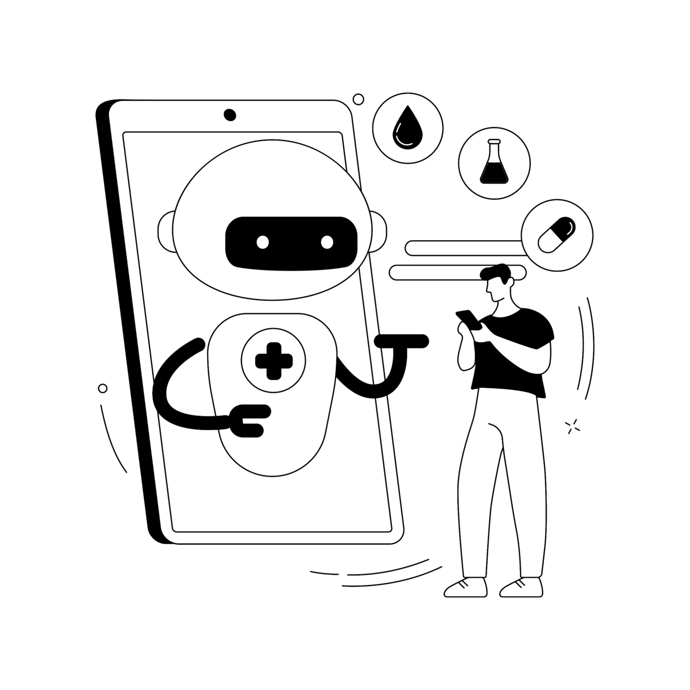

<div align="center">
  
  <h1>MediBot — Retrieval-Augmented Generation (RAG) for Trusted Medical Answers</h1>
  <p><em>Flask • LangChain • Pinecone • HuggingFace MiniLM • Groq (Llama 3) • (Optional) SerpAPI fallback • <strong>Deployed on AWS</strong></em></p>
</div>


> Live app: **[Open MediBot (Live)](http://16.16.207.95:8501/)**

A retrieval-augmented medical Q&A chatbot. It embeds expert-authored medical documents, stores them in a Pinecone vector index, retrieves the most relevant chunks for a user query, and generates grounded answers with a Groq-hosted LLM via LangChain. A minimal Flask app provides a real-time chat UI and a simple API. If no trustworthy match is found, an optional SerpAPI fallback performs a web search and clearly labels the source.

---

## Table of Contents

1. [Abstract](#abstract)
2. [Project Description](#project-description)
   - [Key Components](#key-components)
   - [System Goals](#system-goals)
3. [Features](#features)
4. [Project Structure](#project-structure)
5. [Installation](#installation)
   - [Prerequisites](#prerequisites)
   - [Local Setup](#local-setup)
   - [Production Setup (AWS)](#production-setup-aws)
6. [Configuration](#configuration)
7. [Usage](#usage)
   - [Run Locally](#run-locally)
   - [Run in Production (AWS)](#run-in-production-aws)
   - [API](#api)
8. [RAG Pipeline](#rag-pipeline)
   - [Chunking & Retrieval Settings](#chunking--retrieval-settings)
   - [Fallback Strategy](#fallback-strategy)
9. [Performance](#performance)
10. [Evaluation & Results](#evaluation--results)
11. [Safety & Compliance](#safety--compliance)
12. [Use Cases](#use-cases)
13. [Deployment](#deployment)
14. [Demo & Poster](#demo--poster)
15. [Future Work](#future-work)
16. [Contributing](#contributing)
17. [License](#license)
18. [Authors & Course](#authors--course)
19. [Contact](#contact)
20. [References](#references)
21. [Credits](#credits)

## Abstract

MediBot implements Retrieval-Augmented Generation (RAG) for medical queries. Documents are embedded using a HuggingFace MiniLM model, stored in Pinecone for fast similarity search, and fed to a Groq LLM (Llama 3) via LangChain to generate concise, source-grounded answers. A Flask web interface enables real-time interaction. When the knowledge base can’t confidently answer, a SerpAPI fallback performs a trusted web search and clearly labels web-sourced responses. The system is **deployed on AWS** and is live at **[Open MediBot (Live)](http://16.16.207.95:8501/)** (update this), enabling public access in a production setting.

## Project Description

Medical information is vast and context-dependent. Rather than relying on an LLM’s parametric memory, this chatbot retrieves the most relevant passages from a curated, expert-authored corpus and uses them as context for answer generation. This grounds responses in real content and improves trustworthiness and traceability.

### Key Components

- **Flask UI:** Lightweight web interface for chatting with the model.
- **HuggingFace Embeddings:** `sentence-transformers/all-MiniLM-L6-v2` (384-dim) to represent documents/queries.
- **Pinecone Vector Store:** Stores embeddings in index **`medicalbot`**; cosine similarity search.
- **Groq LLM via LangChain:** ChatGroq with Llama 3 / Mixtral to synthesise answers over retrieved context.
- **LangChain RAG Chain:** Runnable graph for retrieval + generation with prompt templates and history.
- **(Optional) SerpAPI Fallback:** Web search with explicit “External source (web)” labelling in the UI.
- **AWS Deployment:** EC2-hosted Flask app behind Nginx (or directly via Docker), environment-driven config.

### System Goals

- **Grounded answers:** Minimise hallucinations via retrieved evidence & citations.
- **Speed:** Fast retrieval + inference for real-time Q&A.
- **Safety:** Clear guardrails, transparent source, non-diagnostic use.
- **Scalability:** Grows with more documents and concurrent users; **cloud-ready on AWS**.

## Features

- 🔎 Similarity search over embedded **expert medical PDFs**
- 🧠 RAG answer generation with **Groq** LLMs
- 🌐 **SerpAPI** fallback with explicit source labelling (optional)
- 🖥️ Flask chat UI and JSON API
- 🧾 Source snippets + page numbers (when available)
- 🔐 `.env`-based configuration for API keys
- ☁️ **Live on AWS** with public access (link above)
- ⚙️ Modular code to swap models, indexes, and prompts

## Project Structure

```plaintext
ai-medical-chatbot/
├── app.py                      # Flask entrypoint (UI + /get API)
├── src/
│   ├── __init__.py             
│   ├── helper.py               # Data Split to chunks + Embeddings (HuggingFace) + GoogleSearch (Fallback)
│   ├── prompt.py               # Prompt for LLM Model
│   ├── fallback.py             # (Optional) SerpAPI fallback logic
│   ├── config.py               # Settings and constants
│   └── utils.py                # Helpers (formatting, safety, etc.)
├── templates/
│   └── chat.html               # Chat UI (labels whether answer is KB or Web)
├── static/
│   ├── styles.css              # Styles
│   └── images/                 # Logo, screenshots
├── docker/
│   ├── Dockerfile              # Container image for AWS deploy
├── requirements.txt
├── store_index.py              # Pinecone Create/Initialise
├── .env.example                # Copy to .env and fill keys
└── README.md
```

## Installation

### Prerequisites

- Python 3.10+
- Pinecone account + API key
- Groq API key
- (Optional) SerpAPI key for fallback
- A curated set of **expert-authored medical PDFs** to embed
- **AWS EC2** instance (Ubuntu recommended) with security group allowing HTTP/HTTPS

### Local Setup

1. **Clone and enter the repo**
   ```bash
   git clone https://github.com/ACM40960/AI-Medical-LLM.git
   cd AI-Medical-LLM
   ```

2. **Create and activate a virtual environment**
   ```bash
   python -m venv venv
   # macOS/Linux
   source venv/bin/activate
   # Windows (PowerShell)
   venv\Scripts\Activate.ps1
   ```

3. **Install dependencies**
   ```bash
   pip install -r requirements.txt
   ```

### Production Setup (AWS)

- **Docker**
  1. Install Docker on EC2.
  2. Build & run:
     ```bash
     docker build -t medibot:latest .
     docker run -d --name medibot -p 8080:8080 --env-file .env medibot:latest
     ```

- **CI/CD**
  - Use GitHub Actions to build and deploy on push to `main` (Docker or rsync/SSH).

## Configuration

Create a `.env` file (or copy from `.env.example`) and set:

```dotenv
# Pinecone
PINECONE_API_KEY=...
PINECONE_INDEX_NAME=medicalbot

# HuggingFace Embeddings
EMBEDDINGS_MODEL=sentence-transformers/all-MiniLM-L6-v2

# Groq
GROQ_API_KEY=...
GROQ_MODEL=llama3-70b-8192  # or mixtral-8x7b, etc.

# Optional fallback (SerpAPI)
SERPAPI_API_KEY=...

# App
FLASK_HOST=0.0.0.0
FLASK_PORT=8080
TOP_K=3
FLASK_ENV=production        # set to production on AWS
```

> On AWS, keep the `.env` file outside of version control and rotate keys regularly.

## Usage

### Run Locally

```bash
python app.py
# App runs at http://localhost:8501
```

### Run in Production (AWS)

- **Docker**: run the container as shown in the Production Setup section.
- Access the live app at **[Open MediBot (Live)](http://16.16.207.95:8501/)**.

### API

**POST /get** (example)

```bash
curl -X POST http://16.16.207.95:8501//get \
  -H "Content-Type: application/json" \
  -d '{"query":"What are common symptoms of anemia?"}'
```

**Response**


```json
{
  "answer": "Concise, grounded answer...",
  "sources": [
    {"title": "Doc A", "page": 14, "url": "..."}
  ],
  "provenance": "knowledge_base"  // or "web" when SerpAPI fallback is used
}
```

## RAG Pipeline

**Offline Indexing**
1. Load PDFs (e.g., via LangChain `PyPDFLoader`).
2. **Chunk & preprocess:** 500-token chunks with 50-token overlap.
3. **Embed chunks** with MiniLM and upsert vectors into Pinecone.

**Online Inference**
1. **Embed query** with MiniLM; retrieve **top-k=3** similar chunks (cosine similarity, 384-dim vectors).
2. **Construct prompt** with retrieved evidence and citation slots.
3. **Generate answer** via Groq LLM (ChatGroq) using LangChain’s runnable graph.
4. **Return** answer with citations; if evidence is insufficient, trigger **SerpAPI fallback** and label as web-sourced in UI.

### Chunking & Retrieval Settings

- Chunk size: **500 tokens**
- Overlap: **50 tokens**
- Embedding: **MiniLM-L6-v2 (384-dim)**
- Similarity: **cosine**
- Retriever: **top_k=3**

### Fallback Strategy

- If retrieval confidence is low or no relevant chunks are found, call **SerpAPI** for a trusted web search.
- UI clearly labels: “**External source (web)**” and cites the URL.
- The bot **does not fabricate** an answer when evidence is missing.

## Performance

Representative timings from our tests (hardware/network-dependent):

- **Total response latency:** ~**100 ms**
- **Retrieval time:** ~**20 ms**
- **LLM inference time:** ~**3 ms**

> Tip: instrument LangChain callbacks to track median latency and error rate over time.

## Evaluation & Results

- **Test Suite:** >**50** medical questions drawn from textbook chapters.
- **Internal query accuracy:** **100%**
- **Fallback use rate:** **10%**
- **Error rate:** **0%**
- **Hallucinations:** None observed in tests.

## Safety & Compliance

- **EU AI Act (2024):** Treated as a **high-risk** context; designed for transparency and safety.
- **Non-diagnostic use:** Educational/informational only; **not medical advice**.
- **Data protection:** **No personal data** processed; aligns with **GDPR** and **HIPAA** principles.
- **Ethical design:** Informed by **Hippocrates** human-first framework.
- **Provenance:** Every response indicates whether it came from the **knowledge base** or from the **web** (fallback).

## Use Cases

- **Student Support** | **Patient Clarity** | **Hospital FAQs** | **NGO Assistance** | **Offline Access**

## Deployment

- **Cloud:** AWS (EC2; works with Docker or Gunicorn + Nginx).  
- **Status:** Live at **[Open MediBot (Live)](http://16.16.207.95:8501/)**   
- **Security:** Use HTTPS (Nginx + Certbot), restrict inbound ports, rotate API keys.  
- **CI/CD:** GitHub Actions workflow to build Docker image and deploy on push to `main`.  
- **Scaling:** Vertical (bigger EC2) or horizontal (behind a load balancer + multiple containers).

## Demo & Poster

- **Live app:** [Open MediBot (Live)](http://16.16.207.95:8501/)  
- Poster PDF: `docs/MediBot_Poster.pdf`.

## Future Work

- **Global languages** and **voice support**
- **Resource expansion** (broader, multilingual corpora)
- **Doctor co-pilot** mode; **EHR integration** (with strict security)
- **Feedback loops** for retrieval & prompt tuning
- **Ingestion dashboard** and source highlighting in UI

## Contributing

Contributions are welcome! Please open an issue or submit a PR for bug fixes, features, or documentation improvements.

### Quick Guide

1. Fork the repo
2. Create a feature branch
3. Commit changes with clear messages
4. Open a pull request

## License

This project is licensed under the **MIT License**. See the `LICENSE` file.

## Authors & Course

- **Netheeswaran A** (24204827)  
- **Vimarish K M** (24229318)  
**ACM40960 — Projects in Maths Modelling**

## Contact

For questions or suggestions, please open an issue or contact: **netheeswarana@gmail.com** / **vimarish18100@gmail.com**

## References

1. Lewis et al. (2020) — Retrieval-Augmented Generation  
2. Singhal et al. (2023) — Med-PaLM  
3. EU AI Act (2024)  
4. Hippocrates (2023) — Ethical design in AI  
5. Yang et al. (2024) — LLM eHealth Chatbots  
6. Laranjo et al. (2020) — Chatbot design principles  
7. LangChain Docs • Pinecone Docs • Groq API • SerpAPI Docs

## Credits

- HuggingFace (MiniLM embeddings)  
- Pinecone (vector database)  
- LangChain (retrieval orchestration)  
- Groq (LLMs for generation)  
- Flask (web framework)
